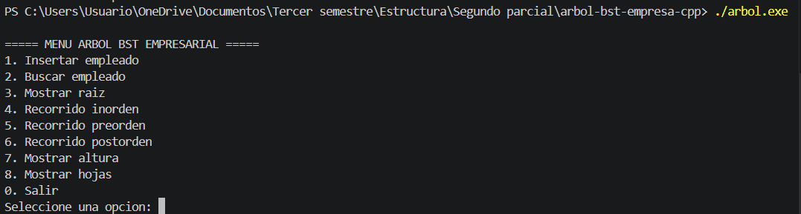
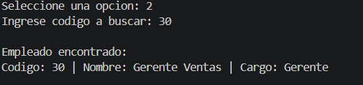
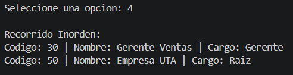
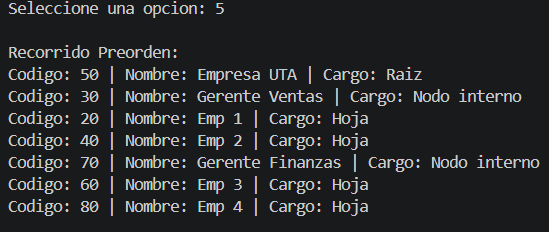
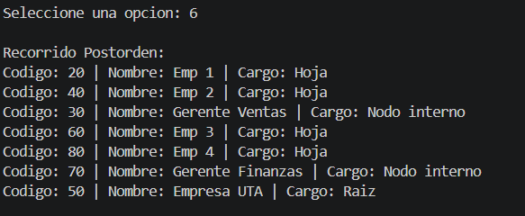
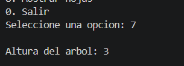
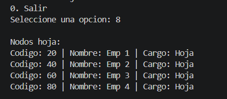

# arbol-bst-empresa-cpp
# Árbol BST Empresarial en C++

Implementación de un Árbol Binario de Búsqueda (BST) para organizar empleados de una empresa, con menú interactivo desde la terminal.

##  Integrante

Justin Israel Sigcha Arcos 

## Objetivo

Implementar en C++ un Árbol Binario de Búsqueda (BST) para organizar empleados de una empresa usando un código numérico como clave, identificando raíz, niveles, nodos internos y hojas.


## Funcionalidades

| Función                    | Descripción 

| Insertar empleado          | Agrega un empleado al árbol según su código 
| Buscar empleado            | Busca un empleado por su código numérico 
| Mostrar raíz               | Muestra el nodo raíz del árbol 
| Recorrido inorden          | Muestra empleados en orden ascendente por código |
| Recorrido preorden         | Recorre raíz → izquierda → derecha 
| Recorrido postorden        | Recorre izquierda → derecha → raíz 
| Calcular altura            | Muestra el número de niveles del árbol 
| Mostrar hojas              | Muestra los nodos sin hijos  


## Estructura del repositorio

arbol-bst-empresa-cpp/
│
├── src/
│   └── main.cpp          # Código fuente principal
│
├── capturas/
│   ├── menu.png          # Captura del menú principal
│   ├── insercion.png     # Captura de inserción de empleados
│   ├── busqueda.png      # Captura de búsqueda
│   ├── recorridos.png    # Captura de los recorridos
│   └── altura_hojas.png  # Captura de altura y nodos hoja
│
└── README.md

##  Cómo compilar y ejecutar

### Compilar
g++ src/main.cpp -o arbol

### Ejecutar
arbol.exe

##  Capturas de ejecución

### Menú principal


### Inserción de empleados


### Raiz


### Búsqueda de empleado


### Recorridos




### Altura y nodos hoja




##  Conceptos clave

| Concepto         | Definición |

| **Raíz**         | Nodo principal del árbol, sin nodo padre. En el ejemplo: código 50 
| **Nodo interno** | Nodo que tiene al menos un hijo (ej: códigos 30 y 70) 
| **Hoja**         | Nodo sin hijos (ej: códigos 20, 40, 60, 80) 
| **Nivel**        | Distancia de un nodo a la raíz. La raíz está en nivel 0 
| **Altura**       | Número total de niveles del árbol 


##  Organigrama de ejemplo

              [50] Gerente General
             /                    \
    [30] Jefe RRHH          [70] Gerente Finanzas
    /          \              /               \
[20] Emp1   [40] Emp2   [60] Emp3         [80] Emp4
```

##  Conclusión

El Árbol Binario de Búsqueda permite organizar información jerárquica de forma eficiente. Las búsquedas son rápidas porque en cada nodo se descarta la mitad del árbol, logrando una complejidad de O(log n) en árboles balanceados. Esta estructura es ideal para representar organigramas empresariales donde se necesita orden y jerarquía.